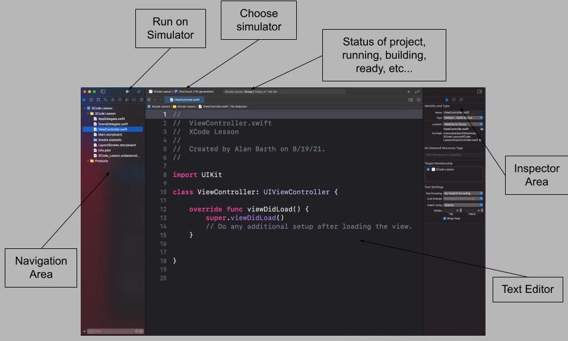

# XCode and Debugging

## Learning Objectives
- How to create a project in Xcode
- Be able to manuever around Xcode
- Be able to upload a Xcode project to Canvas
- Be able to desribe simple debugging techniques
- Know how to run a project on device

## Project Details

## App Types

When you create a new project Xcode will ask you what type of app you want to create. All of the types just give you different defaults. No matter what you do you can still go back and change any of it. That being said always use the "App" one.
- App - Default use this for almost everything you do.
- Document App - For apps that use technologies like UIDocument
- Game - Comes pre-loaded with frameworks helpful for game development
- Augmented Reality - Comes ready to go with camera and helpful AR frameworks
- Sticker Pack - Allows you to create stickers to be added into iMessage
- iMessage - Ability to create apps for the iMessage store.

*Bundle ID*
Your Bundle ID is what make your app unique from other apps. It is used if you want to put your app in the App Store or occsionally for third party frameworks. It is common for Bundle ID's to follow this format:
com.firstnamelastname.projectname || com.businessname.projectname

*Storyboard/SwiftUI*

## File Types

- .xcodeproj - This is your project file. You can open this file to open your project, but this file does not contain all of your project files.
- .storyboard - File that contains what your project looks like
- .xcassets - This is a folder where you keep images and other assets needed for your project
- .plist - This file is for the settings in your project, that includes security, defaults, etc...

## How to Submit an Xcode Project to Canvas

In order to submit a full project to canvas you need to compress all of the files into one compressed file. To do this navigate to your project in finder. Find the outermost folder. Open the menu for that folder and select the compress option. Upload the compressed folder to canvas. 
If you upload the .xcodeproj file or the wrong folder I will be unable to view it.

## Debugging

You will write some code that does not work. To find the issue and fix it Xcode gives a variety of tools.

- breakpoints - You can put a breakpoint on any line of your code. Once the compiler gets to that line of code it will pause the build.
When the compiler is paused on a line of code you can do the following:
- console, PO values - In the console you can call the command po (print object) and a variable name to see what the value of any object is/.
- step over controls - In the toolbar of the console you can use step over controls to skip to next line or function.

### Warnings vs Errors

A Warning means that your code will run, but there may be issues. Sometimes the warning can be as simple as you didn't use a variable that you declared, but can often be helpful in helping you find potential future issues.

An Error means that your code will not compile. In order to have your code compile you will need to fix the error. There are many errors that you can encounter. At times there will be a "Fix" option on the error. This will change your code for you, I would not recommend using the Fix unless you know what it's going to do and are comfortable with doing so.

### Deprecation

At times you will get a line of code that gives you a warning that something was deprecated in a recent iOS update. That means that the framework your using is no longer supported. Typically there is a time window for you to update your code to the new stuff. Many times the deprecation warning will also give you an option to "Fix" with the new framework.

### Compiler Error vs Run Time Error

A compiler error is the red errors that you get in your code. The code will not compile when you have a compiler error.

A run time error means that you code was able to run, but then something in your code caused the system to crash. There are a few reasons this can happen the most common is that you are using a variable that does not have a value, or are trying to reference an index that does not exist. You can use your debugging tools to help you determine why you have a run time error.

## Running a project on your device

In order to build your project on your device you need to be part of the Apple Developer Program. You can join here: [Apple Developer Program](https://developer.apple.com/programs/) for free. Once you've joined the program you need to add your account into XCode. You can do this by going to Xcode -> Preferences -> Accounts -> + -> Add your account.

Once you've added your account you need to plug your device into your computer using any lightning connector that you have. Then you should see your device as an option when you select a different simulator in the toolbar of Xcode.

## Helpful Keyboard Shortcuts

Here are a list of helpful keyboard shortcuts:

| Command | Description |
|---------|-------------|
|Command - r | Run your project |
|Command - b | Build your project |
|Command - k | Clean your project |
|Command - a | Select everything in your file |
|Control - i | Re-ident all of your selected code |
|Command - / | Comment selected text |
|Option - click | Shows quick help, gives an introduction|
|Command - click | Shows a menu of options to choose from|

